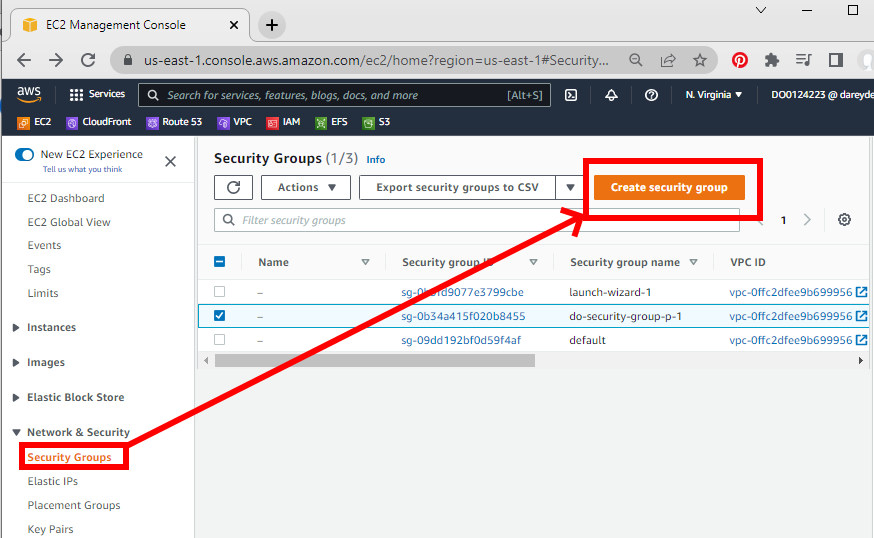
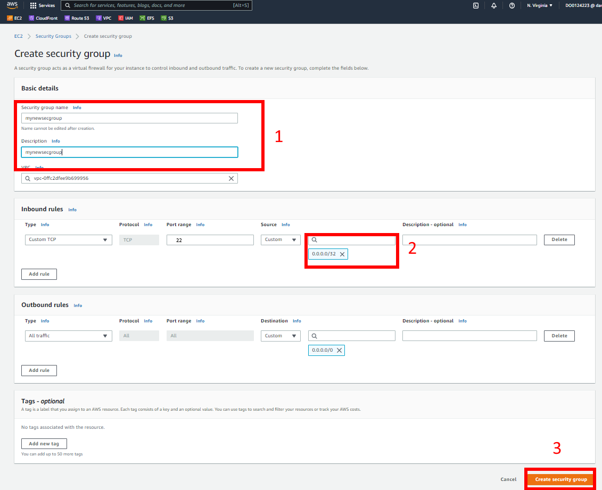
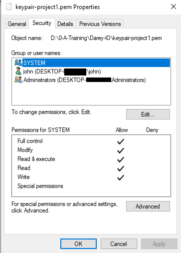
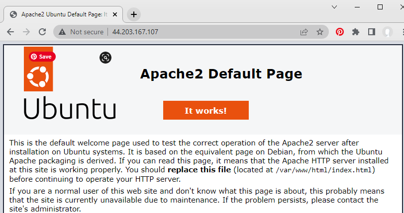
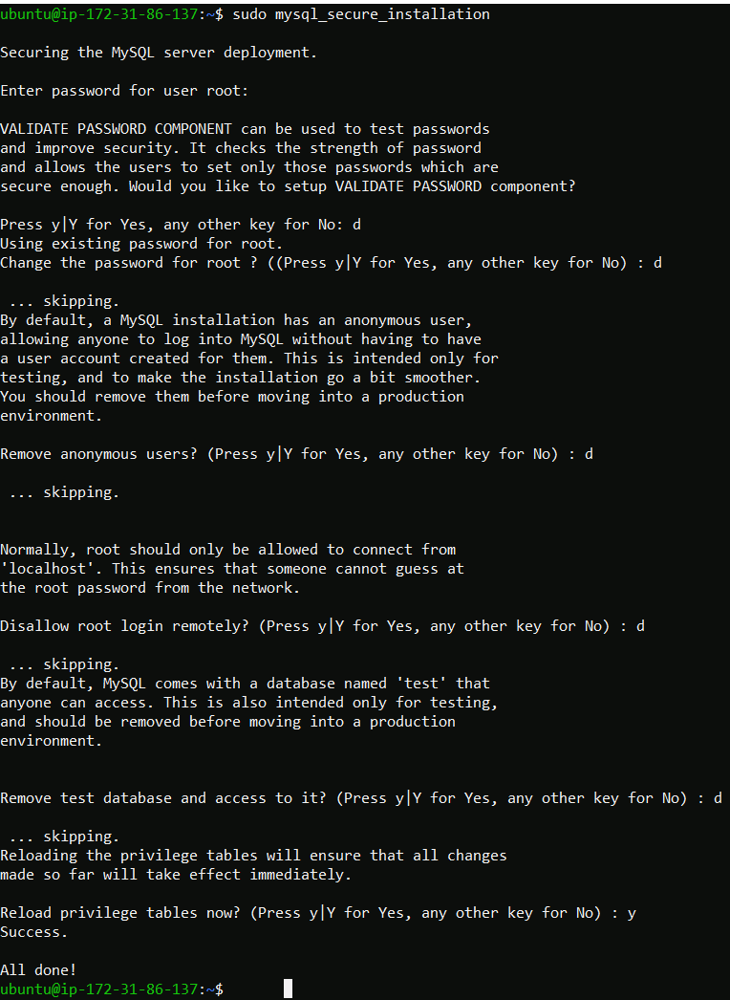

# <div align="center"> Installing a LAMP Stack in AWS / Project-1</div>
### LAMP is an acronym for the operating system, Linux; the web server, Apache; the database server, MySQL; and the programming language, PHP
___
__Overview of the main steps to complete the Stack__
1. Installing Apache Web Server and updating the firewall
    * Prerequisites
       *  AWS account setup and Provisioning an Ubuntu Server
       *  Connecting to your EC2 Instance

2. Installing MySQL
3. Installing PHP
4. Creating a virtual host website using Apache
5. Enable PHP on the website
___
### <div align="center"> Step 1) Installing Apache and updating the firewall (security group) </div>

From an AWS acount navigate to the EC2 service and choose __Security Groups__ under the __Network & Security__ header on the left pane <br/>
Then click create security group on the orange button on the upper right corner of the screen <br/> 

 <br/>


On the creation page i  added a new security group name and a description, clicked add rule under inbound rules to add source ip address. I chose Custom TCP i the __type__ section and entered 22 the (SSH TCP port) in the __port range__ seection. I entered my WAN IP address in the Source IP address box with a /32 so only I have acess to the instance



From an AWS account create an EC2 Ubuntu instance. During the creation select the create new key pair buttom in the key pair header of the creation options.
I saved this file to my local laptop. (I will need to change permissions on it in the next step.

  * The keypair is need to securely connect to the new EC2 instance from my local computer.


Also during the creation I chose the __security group__ i had crated in a previuos step. 

When my EC2 instance is completed the Instance state will indicate runnnig. I also ensured the __Status Check__ is 2/2 checks passed


Before I can use the PEM file to SSH (Secure Shell) to my instance from a Windows OS I need to change the permissions on the file <br/>
`sudo chmod 0400 <private-key-name>.pem`

Note: For me the Linux `chmod` command had no affect to the permissions of the file on my windows 10 Home laptop <br/>
In order to lower the permisions I had to change it from a Windows Security GUI
Removing the __everyone__ and __all users__ access completely and making it look like this.



From my windows terminal my current directory is the one where I downloaded the private key PEM file to. I executed the following command ssh: <br/>
`ssh -i <private_keyfile.pem> username@ip-address`

On the first logon i was prompted to add the __key fingereprint__ to my __known hosts__ file <br/>


Once I am logged in to my new Linux EC2 instance and at the $ prompt i ran the following two commands one at a time
```
#update a list of packages in package manager
$sudo apt update

#run apache2 package installation
$sudo apt install apache2
```
After the Apache2 is installed I ran the follwing command to make sure it is running. <br/>
I can see the active (running) in green on the third line of the output
`sudo systemctl status apache2`


I then ran this command to start the Apache2 service automatically when the server is restarted.. <br/>
```
$ sudo systemctl enable apache2
```
Before I can receive any traffic by my Web Server, I need to open TCP port 80 which is the default port that web browsers use to access web pages on the Internet
To do this i edited the security group I attaed to the EC2 instance during it's creation

I am now ready to test if the Webserver is responding to requests.
To do this I ran the following two commands from the Linux console. Therse to commands check the web service locally <br/>
```
# This first command checks if the DNS Service is functioning, since it uis using it's name and not IP address. 
# The second command does the same thing via IP address
curl http://localhost:80 
curl http://127.0.0.1:80

```
The Apache Service responds to the curl request


Now I can test if my Web Server is accessible over the Internet and get through my firewall
To do this i retirieved the web servers public ip address from the Linux console with the following commnand
``` 
curl -s http://169.254.169.254/latest/meta-data/public-ipv4
```


And then i accessed my webserver from my local laptops web browser using that public ip address gained from the previous command


___
### <div align="center"> Step 2) Installing MySQL </div>

Now that I have a web server up and running, I need to install a Database Management System (DBMS) to be able to store and manage data for my site in a relational database. MySQL is a popular relational database management system used within PHP environments, so I will use it in my project.

I use ‘apt’ run from the SSH session to acquire and install this software:
```
sudo apt install mysql-server
```
I then check if SQL is up and running after the install with the command
```
systemctl status mysql
```


Now i am able to login as root (which is inferred by the use of sudo) to the Mysql server from the remote console
```
sudo mysql
```
This brings me to a mysql> prompt on the console

Now I will set a password for root user using using mysql_native_password as default authentication method
```
ALTER USER 'root'@'localhost' IDENTIFIED WITH mysql_native_password BY '******'; NOTE: the actual Passowrd in this illustration has been astericked out
```
I then exit the mysql shell with the exit command
```
mysql> exit
```
At this point it is recommended that you run a security script that comes pre-installed with MySQL. This script will remove some insecure default settings and lock down access to your database system <br/>
I chose the least restrictive responeses since this is a Lab environment.


Now I test to see if i can log into mysql console
```
sudo mysql
```

___
### <div align="center"> Step 3) Installing PHP </div>
I now have Apache installed to serve my content and MySQL installed to store and manage my data. PHP is the component of my setup that will process code to display dynamic content to the end user. In addition to the php package, I'll need php-mysql, a PHP module that allows PHP to communicate with MySQL-based databases. I’ll also need libapache2-mod-php to enable Apache to handle PHP files. Core PHP packages will automatically be installed as dependencies.

To install these 3 packages at once, I will run:

```
sudo apt install php libapache2-mod-php php-mysql
```

I run the following command to confirm my PHP version:
```
php -v
```

___
### <div align="center"> Step 4) Creatring a virtual host for my website using Apache </div>
To test my setup with a PHP script, I will set up a proper Apache Virtual Host to hold my website’s files and folders. Virtual host allows me to have multiple websites located on a single machine and users of my websites will not even notice it. (illistrated below) <br/>

